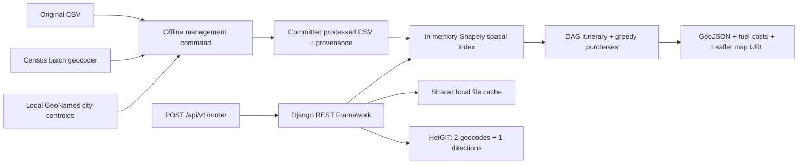

# Spotter Fuel Route API

Django API for a U.S. driving route, cost-aware fuel purchases, and a browser map. Vehicle assumptions: **500-mile range, 10 MPG, 50-gallon tank**. The employer's original CSV is preserved byte-for-byte.

## Architecture



Responsibilities are separated in `routes/routing.py`, `stations.py`, `optimization.py`, `service.py`, and `preprocessing.py`. SQLite is configured but request handling needs no database tables or migrations. The shared filesystem cache works across Gunicorn workers on one instance; station objects and the spatial index are loaded once per worker, with reload on dataset replacement.

## Fuel model and optimization

The vehicle starts with fuel **purchased and loaded at the origin**, priced from a dataset station within 25 geodesic miles. Reference selection adds five miles to centroid distances, preferring a Census location when reasonably nearby. This is a price reference, not a claimed visit; the response exposes its coordinates, distance, quality, gallons, and cost. Initial fuel is never free. The algorithm chooses the initial quantity, charges all purchases, and finishes with zero estimated fuel. No reserve, price tax adjustment, idle consumption, or purchase transaction fee is modeled.

1. Query separate configurable corridors: **15 miles for Census locations, 35 miles for city centroids**. The wider city corridor preserves highway coverage when a centroid is displaced from the truck stop. EPSG:5070 supplies projection; WGS84 geodesic distances supply lateral distance and progress, scaled to provider road mileage. Centroid progress is approximate; degrees are never treated as miles.
2. Census one-way access is estimated as `1.4 × lateral miles`, capped at 20 round-trip miles. Centroid access uses a **planning uncertainty budget** of `1.4 × centroid offset + 5` one-way miles, capped at 110 round-trip miles (the 35-mile corridor requires up to 108). This budget is not a measured station detour and prevents fake zero-access advantages.
3. Build a forward DAG. An edge is feasible only when `progress difference + departure access + arrival access <= 500 miles`. Shortest-path dynamic programming minimizes a just-enough-per-leg fuel-cost upper bound **plus $15 per centroid stop**. This configurable selection penalty favors competitive accurately located alternatives; it is never billed or included in fuel cost. Ties prefer fewer stops, then deterministic record order.
4. On that itinerary, buy enough to reach the first reachable cheaper station; otherwise fill up, or buy only enough to finish. This exchange-rule algorithm minimizes continuous fuel purchase cost **for the fixed itinerary**. Remove zero-purchase visits, remove their detours, and recalculate until stable.

This is **cost-optimized, not globally optimal across all possible itineraries**. Capacity and conservation are enforced before presentation rounding. Cost uses `Decimal`; mileage retains full floating-point precision. The total is rounded once from unrounded purchases, so displayed stop cents may sum a cent differently. Route duration and geometry describe the provider's main route, excluding estimated station access and fueling time.

## Dataset preprocessing

**Normal requests never geocode fuel stations. Coordinates are prepared once.** Generated data is committed so fresh Docker/Render deployments need no Census access.

| Stage | Records |
|---|---:|
| Supplied CSV | 8,151 |
| Canadian records excluded | 620 |
| U.S. rows before deduplication | 7,531 |
| Exact normalized duplicates removed | 26 |
| Unique valid U.S. records | 7,505 |
| Validated Census address/junction matches | 154 |
| GeoNames city-centroid fallback | 6,859 |
| Unmatched/ambiguous city footprints excluded | 492 |
| Located records used by app | 7,013 (93.44%) |

No source rows had malformed fields or invalid prices; prices range from $2.68733333 to $6.399. Repeated OPIS IDs with different names/addresses are retained. Counts refer to records, not independently verified physical sites.

The source contains no latitude/longitude. `prepare_fuel_data` validates fields, prices and U.S. states, then submits one 7,505-address Census batch. Query normalization preserves highway identifiers and removes exit numbers only when named roads establish a junction; original descriptions remain unchanged. Matches must preserve city, street number and road identifiers: Census can otherwise interpret an exit as a house number or return a different city's road. Normalization increased validated matches from 144 to 154; see the audit below.

Non-standard highway addresses fall back to an exact normalized city/state lookup in local GeoNames postal data. Centroids average unique postal coordinates; footprints exceeding a 10-mile radius are excluded. Located records are **2.20% Census and 97.80% approximate centroids**. Coordinate quality affects corridor selection, access budgets and optimization. Each stop exposes `geocoding_source`, `location_is_approximate`, `detour_is_estimated` and `detour_basis`; centroid stops also expose `centroid_to_route_miles`. All road access is estimated, including Census matches. **Centroid positions are city-level candidates: exact truck-stop proximity and road-access distance cannot be guaranteed.**

Generated statistics and input/result checksums are in `data/preprocessing_stats.json`; exclusions are in `data/fuel_stations_unmatched.csv`. Cached upstream downloads live in ignored `.cache/preprocessing/`. Repeated preparation reuses these downloads and produces deterministic content. `--refresh` explicitly downloads again; `--offline` requires both cached sources and makes zero network calls. Failed/incomplete batch responses fail visibly rather than silently dropping rows.

Sources: [Census API and batch format](https://geocoding.geo.census.gov/geocoder/Geocoding_Services_API.html), [GeoNames postal data](https://download.geonames.org/export/zip/), [GeoNames attribution/license](https://download.geonames.org/export/zip/readme.txt) (CC BY 4.0).

## Setup and run

Requires Python 3.12+; pinned Django **6.1.1**, the [current stable release](https://www.djangoproject.com/download/). Windows uses `.venv\Scripts\Activate.ps1` instead of the POSIX activation command below.

```bash
python -m venv .venv
source .venv/bin/activate
pip install -r requirements-dev.txt
cp .env.example .env
# Set a random DJANGO_SECRET_KEY and your ORS_API_KEY in .env.
python manage.py check
python manage.py collectstatic --noinput
python manage.py runserver 127.0.0.1:8000
```

Optional rebuild of the committed dataset:

```bash
python manage.py prepare_fuel_data
python manage.py prepare_fuel_data --offline
python manage.py audit_fuel_addresses  # Cached response classification; no network calls.
```

| Variable | Purpose/default |
|---|---|
| `DJANGO_SECRET_KEY` | Required secret; never commit |
| `ORS_API_KEY` | HeiGIT API key; required for uncached provider calls |
| `DJANGO_DEBUG` | `false`; local development may enable it |
| `DJANGO_ALLOWED_HOSTS` | `localhost,127.0.0.1`; Render host is appended automatically |
| `DJANGO_SECURE_SSL_REDIRECT` | `false` locally; `true` behind Render HTTPS |
| `ROUTE_CORRIDOR_MILES` | 15-mile Census candidate corridor |
| `MAX_DETOUR_MILES` | 20-mile Census estimated round-trip access cap |
| `CENTROID_CORRIDOR_MILES` | 35-mile approximate city candidate corridor |
| `CENTROID_MAX_DETOUR_MILES` | 110-mile round-trip centroid uncertainty budget cap |
| `CENTROID_STOP_PENALTY_USD` | $15 selection penalty per centroid stop; not fuel spend |
| `STATION_DATA_PATH` | Optional processed CSV path override |

HTTP clients use direct connections rather than inherited proxy settings. Five-second connect and 30-second read timeouts bound routing calls; Census preprocessing allows ten minutes. There are no automatic retries, preventing hidden quota multiplication. Never put keys in request URLs, responses, collection files, or map HTML.

## API and Postman

```bash
curl -X POST http://localhost:8000/api/v1/route/ \
  -H 'Content-Type: application/json' \
  -d '{"start":"Dallas, TX","finish":"Los Angeles, CA"}'
```

Import `postman/Spotter-Fuel-Route-API.postman_collection.json`; set `base_url` to localhost or the Render URL. It includes health, Dallas–Los Angeles, New York–Chicago, New York–Seattle, and invalid-input requests. Open the returned `map_url` on the same host. Maps include the complete route, endpoints, numbered stops, price, purchase, cost, and location quality. They expire after one hour and can disappear sooner after cache eviction, restart, or deployment; resubmit to regenerate.

Example **excerpt from a real Dallas–Los Angeles response** (complete geometry and remaining fields omitted here):

```json
{
  "route": {"distance_miles": 1442.68, "duration_hours": 22.06},
  "fuel": {
    "estimated_driving_miles_including_detours": 1475.48,
    "estimated_gallons_consumed": 147.5483,
    "estimated_fuel_cost_usd": 426.77,
    "estimated_arrival_fuel_gallons": 0,
    "longest_leg_miles": 474.2284
  },
  "optimization": {"globally_optimal": false}
}
```

Swagger: `/api/docs/`. OpenAPI: `/api/schema/`. Health: `/health/` reports data readiness without contacting HeiGIT (200 ready, 503 degraded). Errors: 400 invalid input/same endpoint; 422 non-U.S./unresolved/ambiguous/unsupported route or infeasible fuel plan; 429 local throttle; 502 invalid upstream; 503 missing dataset/key/upstream quota; 504 upstream timeout. Anonymous API access is intentional for the assessment; DRF throttles to 60 requests/minute per IP. A public production service should additionally enforce quotas/authentication at its gateway.

## Calls, caching, and performance

A completely cold successful request uses **two endpoint geocodes plus one directions request**, and **zero station calls**. Geocodes cache for 24 hours, directions/plans for one hour. Repeated route requests make zero provider calls. Dataset hash, planning policy version, corridors and quality penalty participate in plan keys; upstream caches remain reusable after a policy change. No raw CSV is parsed per request. Cache files are trusted local application files, never public static content.

Spatial lookup avoids scanning unrelated stations. Candidate projection is proportional to route geometry and corridor stations; itinerary DP has worst-case quadratic candidate complexity with a 500-mile early cutoff. Hardened Docker/Gunicorn Dallas–Los Angeles timing: **4.03 seconds first request, 0.040 seconds cached**, including HTTP/serialization; these are individual samples, not throughput guarantees. Free Render cold starts and provider latency differ.

## Tests and verification

```bash
pytest -q
ruff check .
ruff format --check .
python manage.py check
python manage.py spectacular --validate --file /tmp/schema.yaml
python scripts/smoke_test.py --base-url http://127.0.0.1:8000
```

Normal tests use mocked httpx transports and a clearly labeled deterministic fixture dataset; they require no real key or third-party network. Coverage includes validation, timeouts, malformed responses/rows, Canada filtering, deduplication, centroid provenance, spatial filtering, feasibility boundaries, cost sensitivity, detours, fuel conservation, cache reuse, missing data, map escaping, and exhaustive independent verification of fixed-itinerary greedy purchasing. CI runs Django checks, schema validation, lint/format, and the full suite. See `docs/VERIFICATION.md` for actual results.

## Docker and Render

```bash
docker build -t spotter-fuel-route-api .
docker run --env-file .env -e DJANGO_DEBUG=false -p 8000:8000 spotter-fuel-route-api
```

The image runs as an unprivileged user with Gunicorn (two workers/two threads). Static files are collected at build time and served by WhiteNoise. Production startup never geocodes stations. No volume or database service is necessary for this assessment.

On Render, connect the GitHub repository and create a Blueprint from `render.yaml`. Supply `ORS_API_KEY`; the Blueprint generates the Django secret (or replace it with your own). It configures Python, Gunicorn, static collection, health checks, host allowlisting, and HTTPS/HSTS. No secret is embedded in the Blueprint. [Render Blueprint reference](https://render.com/docs/blueprint-spec). File cache and SQLite are ephemeral on the free service, which is acceptable here because processed data is committed and no durable user state exists. Multiple instances would require a shared cache such as Redis.

## Known limits and demo

Station coordinates and detours are estimates, particularly centroid fallbacks; **500-mile feasibility is guaranteed only under the documented distance model**, not unverified access roads. Sparse western coverage can legitimately yield 422. There is no automatic corridor expansion: it would not justify long access detours. Cross-border routes are forbidden in the provider request. EPSG:5070 candidate projection is intended for the contiguous U.S.; Alaska/Hawaii have no records in this supplied dataset and fail rather than inventing coverage. For operational dispatch, verify station coordinates, route via the selected stops, add a safety reserve, and refresh prices.

Five-minute recording: `docs/LOOM_SCRIPT.md`. Submission links: `docs/SUBMISSION.md`.

**Loom demo URL:** `<add recorded Loom URL>`
